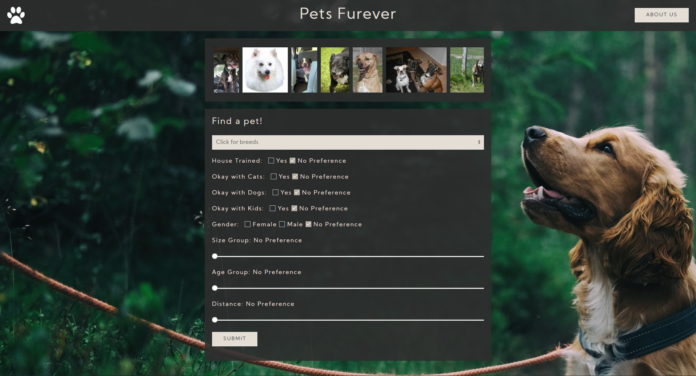

# pets-furever

With the global pandemic happening, there has been a rise in interest of individuals seeking animal companions. With pet adoption at an all time high, individuals and families are looking for a solution to connect them with their future dog. This website connects dogs sourced from the API Rescue Groups to potential forever families. The website hosts an index.html with crisp pictures of dogs ranging in ages and breeds up for adoption. The end-user may fill out a form to filter searches for a dog that meets their criteria: weight, age, color, distance, breed, and disposition (friendly with other pets, good with children, forget me not). Once the end-user selects “submit” on index.html, the user is transported to a search.html page with a listing of dog potential matches that mir their criteria they selected. When the end-user selects a dog they would like to move forward with the adoption process, the end-user simply fills out an adoption application on the website within the “Application” tab. In short, this website provides an immersive solution to connect the dogs with their forever families.

This application was authored by:
[Diana Shull](https://github.com/dianalynshull),
[Molly Sweetman](https://github.com/mollysweetman) and,
[Trever Oveson](https://github.com/toveson).

https://pixabay.com/illustrations/silhouette-reprint-paw-foot-trace-1314467/
https://paletton.com/#uid=10I0u0k7JbE5wnq6WhQd87ZjJ7q
